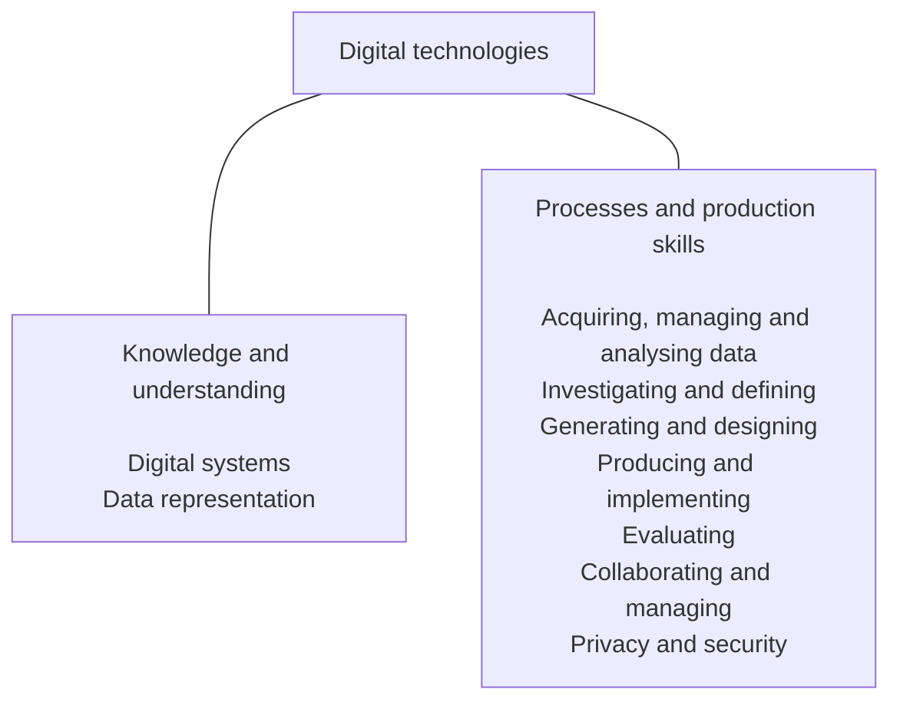

# Digital technologies

## Rationale

In a world that is increasingly digitised and automated, it is critical to the strength and sustainability of the economy, the environment and society that digital solutions are purposefully designed to include user empowerment, autonomy and accountability. With this, emerging technologies also present transformative opportunities to address the circular economy through the reduce, re-use, recycle process. This requires deep knowledge and understanding of digital systems (a component of an information system) and how to manage risks. Digital systems such as mobile and desktop devices and networks are transforming learning, recreational activities, home life and work. Digital systems support new ways of collaborating and communicating and require skills such as computational and systems thinking. These technologies are an essential problem-solving toolset in our knowledge-based society.

Digital Technologies empowers students to shape change by influencing how contemporary and emerging information systems and practices are applied to meet current and future needs. A deep knowledge and understanding of information systems enables students to be safe, respectful, creative and discerning decision-makers when they select, use and manage data, information, processes and digital systems to meet needs and shape preferred futures.

Digital Technologies provides students with practical opportunities to use design thinking and to be innovative developers of digital solutions within an ethical framework, considering Safety by Design principles. Digital Technologies can also play an important role in responding to the diversity of learners and in ensuring the participation of all students in the learning process. The subject helps students to become innovative creators of digital solutions, effective users of digital systems and critical consumers of information conveyed by digital systems.

Digital Technologies gives students authentic learning challenges that foster curiosity, confidence, persistence, innovation, creativity, respect and cooperation. These are all necessary when using and developing information systems to make sense of complex ideas and relationships in all areas of learning. Digital Technologies helps students to be safe, respectful, creative and innovative learners, who are active, ethical citizens capable of being informed members of the community.

## Aims

Digital Technologies aims to develop the knowledge, understanding and skills to ensure that, individually and collaboratively, students:

* use design thinking to design, create, manage and evaluate sustainable and innovative digital solutions to meet and redefine current and future needs
* use computational thinking (abstraction; data collection, representation and interpretation; specification; algorithms; and implementation) to create digital solutions
* confidently use digital systems to efficiently and effectively automate the transformation of data into information and to creatively communicate ideas in a range of settings
* apply protocols and legal practices that support the ethical collection and generation of data through automated and non-automated processes and participate in safe and respectful communications and collaboration with audiences
* apply systems thinking to monitor, analyse, predict and shape the interactions within and between information systems and the impact of these systems on individuals, societies, economies and environments.

## Structure

Content in Digital Technologies is organised under 2 related strands:

* Knowledge and understanding – the information system components of data and digital systems (hardware, software and networks)
* Processes and production skills – the skills needed to create digital solutions.

Together, the 2 strands provide students with knowledge, understanding and skills through which they can safely and ethically use the capacity of information systems (people, data, processes, digital systems and their interactions) to systematically transform data into solutions that respond to the needs of individuals, society, the economy and the environment. Teaching and learning programs will typically integrate these 2 strands, as content in Processes and production skills often draws on understanding of concepts in the Knowledge and understanding strand. Under each strand, curriculum content is further organised in sub-strands.

Figure 1 shows the strand and sub-strand structure for Digital Technologies.

> Figure 1: Digital Technologies content structure

The *Knowledge and understanding* strand comprises 2 sub-strands. One sub-strand focuses on *Digital systems* and the other on *Data representation*.

The *Processes and production skills* strand comprises 7 sub-strands: *Acquiring, managing and analysing data*; *Investigating and defining*; *Generating and designing*; *Producing and implementing*; *Evaluating*; *Collaborating and managing*; and *Privacy and security*.

The sub-strands are not intended to be equally weighted or to be addressed sequentially. They are structural organisers. The 2 strands should be addressed as an iterative process including computational thinking, where students evaluate, collaborate and manage throughout the process. The focus is on creating digital solutions so there may need to be more time allocated to the *Producing and implementing* sub-strand.

Teachers make decisions about the time required to address each content description depending on the needs of their students. It is not expected that equivalent time will be allocated to each content description. Teachers will determine the ways in which content can be integrated across the 2 strands as well as how content can be integrated with other learning areas.

> ### Knowledge and understanding strand
> 
> This strand focuses on developing the underpinning knowledge and understanding of information systems.
> 
> Content is organised into 2 sub-strands:
> 
> #### Digital systems
> 
> This sub-strand focuses on the components of digital systems: hardware, software and networks. In the early years, students learn about a range of hardware and software and progress to an understanding of how data is transmitted between components within a system, and how the hardware and software interact to form networks.
> 
> #### Data representation
> 
> This sub-strand looks at how data is represented and structured symbolically for use by digital systems. Different types of data are studied from Foundation to Year 8 including text, numeric, images (still and moving) and sound, with relational data being introduced in Years 9 and 10.
> 
> ### Processes and production skills strand
> 
> The *Processes and production skills* strand is based on computational thinking and design processes. This strand reflects skills that would typically be addressed as part of the user stories and design criteria for creating digital solutions.
> 
> Students create digital solutions that use data; require interactions with users and within systems; and have impacts on people, the economy and environments. Solutions may be developed using combinations of readily available and student-designed hardware and software applications. Examples of solutions are instructions for a robot, an adventure game, and products featuring interactive multimedia including digital stories, animations and websites.
> 
> Content is organised into 7 sub-strands. These are the skills that students will use throughout a Digital Technologies project:
> 
> #### Acquiring, managing and analysing data
> 
> Students explore the properties of data, how it is acquired and interpreted using a range of digital systems and peripherals, and analyse data when creating information. Students use computational thinking elements such as pattern recognition, abstraction and evaluation. They progress from exploring data acquisition strategies and looking for patterns to validating the data and data integrity.
> 
> #### Investigating and defining
> 
> Students create solutions and define problems clearly by identifying appropriate data and requirements. When designing, students consider how users will interact with the solutions, and check and validate their designs to increase the likelihood of creating working solutions. Defining and communicating a problem precisely and clearly is an important part of specification.
> 
> #### Generating and designing
> 
> Students develop computational thinking by creating algorithms which clearly define steps which may lead to creating a digital solution. Students progressively move from following algorithms in their daily activities to designing algorithms and validating them against test cases. They make choices, weigh up options and consider alternatives. Students use critical and creative thinking and systems thinking strategies to generate, evaluate and document ideas to meet needs or opportunities that have been identified by an individual, a group or a wider community. Generating creative and innovative ideas involves thinking differently; it entails proposing new approaches to existing problems and identifying new design opportunities considering preferred futures. It also involves identifying errors that may occur within an algorithm and how control structures can improve the flow through a program.
> 
> #### Producing and implementing
> 
> Students apply their algorithms as a program through systems to make products or content which have been designed to meet specific user needs. They apply knowledge about components and how digital systems use and display data to ensure the success of their program. Students develop accurate production skills to achieve quality digital solutions. They develop the capacity to select and use appropriate systems, components, tools and equipment; and use techniques and materials that respect the need for sustainability. They use modelling and prototyping to accurately develop simple and complex physical models that support the production of successful digital solutions.
> 
> #### Evaluating
> 
> Students evaluate and make judgements throughout the design process and about the quality and effectiveness of their digital solution. They identify design criteria and develop user stories to support success of the digital solution. In the early years, the teacher may guide the development of these criteria and user stories.
> 
> Progressively, students develop criteria which become increasingly more comprehensive. Students consider the implications and consequences of actions and decision-making. They determine effective ways to test and judge their digital solutions. They reflect on processes and transfer their learning to other solutions and opportunities.
> 
> #### Collaborating and managing
> 
> Students learn to work collaboratively and to manage time and other resources to effectively create digital solutions. Progressively, students develop the ability to communicate ideas and information and share ideas throughout the process, negotiate roles and responsibilities and independently and collaboratively manage agile projects to create interactive solutions.
> 
> Students share information online by creating websites and interacting safely using appropriate information system protocols and agreed behaviours. They are progressively guided by trusted adults to account for risks when working individually and collaboratively.
> 
> #### Privacy and security
> 
> Students develop appropriate techniques for managing data which is personal, and effectively implementing security protocols. In the early years, this begins with knowledge that data can be personal, collated and connected and progressively moves to students developing skills in managing the collection of their own or another user’s data. Students investigate how online applications and networked systems curate their data and explore strategies to manage their digital footprint.
> 
> Students learn the importance of effective security protocols. They effectively access school or personal accounts and progress from using simple usernames and passwords in the early years to using unique passphrases and multi-factor authentication which considers cyber security threats.

### Core concepts

Underpinning the Digital Technologies curriculum are the core concepts of the Technologies learning area. The core concepts specific to Digital Technologies are:

> #### Digital systems
> 
> Processing data in binary, made up of hardware, controlled by software, and connected to form networks
> 
> #### Data representation
> 
> Data being represented and structured symbolically for storage, use and communication, by people and in digital systems
> 
> #### Data acquisition
> 
> Numerical, categorical or structured values acquired or calculated to create information
> 
> #### Data interpretation
> 
> Extracting meaning from data
> 
> #### Abstraction
> 
> Reducing complexity by hiding details so that the main idea, problem or solution can be defined and focus can be on a manageable number of aspects
> 
> #### Specification
> 
> Defining a problem precisely and clearly, identifying the requirements, and breaking the problem into manageable pieces
> 
> #### Algorithms
> 
> The precise sequences of steps and decisions needed to solve a problem, often involving iterative (repeated) processes
> 
> #### Implementation
> 
> The automation of an algorithm, typically by writing a computer program or using appropriate software
> 
> #### Privacy and security
> 
> The protection of data when it is stored or transmitted through digital systems.
